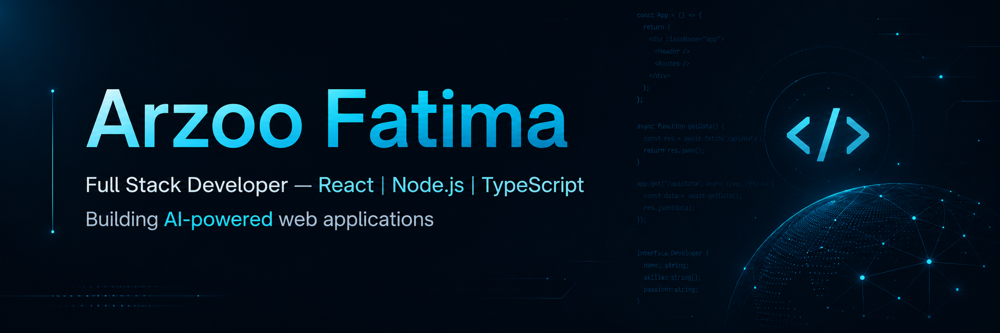

<div align="center">



<br/>


</div>

<br/>


## 👩‍💻 Who I Am

```ts
const arzooFatima = {
  role: "Full Stack Developer",
  focus: "Building AI-powered web applications with clean UI/UX",

  coreStack: {
    frontend: ["React", "Next.js", "TypeScript", "Tailwind CSS"],
    backend: ["Node.js", "Express.js", "REST APIs"],
    database: ["PostgreSQL", "Firebase"],
    ai: ["OpenAI API", "Google Gemini API", "n8n Automation"],
  },

  projects: ["PaperBot", "OrderlyAI", "Tailorly"],

  currentlyBuilding: [
    "Production-ready full-stack applications",
    "Modern frontend interfaces",
    "AI-integrated web products",
  ],

  openTo: [
    "Frontend Developer roles",
    "Full Stack Developer roles",
    "Internships",
    "Open Source Collaboration",
  ],
};

<br/>

## Current Focus

<div align="center">


</div>

<br/>

## Featured Projects

### PaperBot — AI Examination Management System

AI-powered examination platform for generating question papers, conducting online exams, and evaluating answers using AI.

**Role:** Frontend Developer & UI/UX Designer

**Key Work**
- Designed teacher and student interfaces
- Built the frontend using React and TypeScript
- Connected the UI with AI-powered backend workflows

**Tech Stack:** React · TypeScript · Node.js · Express.js · PostgreSQL · OpenAI API

[](https://github.com/arzoofatima25/PapersBot)

---

### OrderlyAI — Restaurant Management System

Production-style restaurant management system with admin dashboard, cashier system, kitchen display, order management, and role-based access.

**Role:** Full Stack Developer

**Key Work**
- Built the frontend with Next.js, TypeScript, and Tailwind CSS
- Developed backend APIs and dashboard logic
- Deployed the project on Vercel

**Tech Stack:** Next.js · TypeScript · Tailwind CSS · Node.js · PostgreSQL · Vercel

[](https://github.com/arzoofatima25/orderlyai)
[](https://orderlyai-sigma.vercel.app)

---

### Tailorly — AI Resume & Cover Letter Tool

AI-powered resume and cover letter tailoring app that customizes resumes according to job descriptions using Google Gemini API.

**Role:** Full Stack Developer

**Key Work**
- Built frontend and backend architecture
- Integrated Firebase Authentication
- Added Gemini API for resume and cover letter generation

**Tech Stack:** React · Express.js · Firebase · Google Gemini API

[](https://github.com/arzoofatima25/Tailorly)
[](https://tailorly-rho.vercel.app)

<br/>
## 🚀 Featured Projects

### PaperBot — AI Examination Management System

AI-powered examination platform for generating question papers, conducting online exams, and evaluating answers using AI.

**Role:** Frontend Developer & UI/UX Designer

**Key Work**
- Designed teacher and student interfaces
- Built the frontend using React and TypeScript
- Connected the UI with AI-powered backend workflows

**Tech Stack:** React · TypeScript · Node.js · Express.js · PostgreSQL · OpenAI API

[](https://github.com/arzoofatima25/PapersBot)

---

### OrderlyAI — Restaurant Management System

Production-style restaurant management system with admin dashboard, cashier system, kitchen display, order management, and role-based access.

**Role:** Full Stack Developer

**Key Work**
- Built the frontend with Next.js, TypeScript, and Tailwind CSS
- Developed backend APIs and dashboard logic
- Deployed the project on Vercel

**Tech Stack:** Next.js · TypeScript · Tailwind CSS · Node.js · PostgreSQL · Vercel

[](https://github.com/arzoofatima25/orderlyai)
[](https://orderlyai-sigma.vercel.app)

---

### Tailorly — AI Resume & Cover Letter Tool

AI-powered resume and cover letter tailoring app that customizes resumes according to job descriptions using Google Gemini API.

**Role:** Full Stack Developer

**Key Work**
- Built frontend and backend architecture
- Integrated Firebase Authentication
- Added Gemini API for resume and cover letter generation

**Tech Stack:** React · Express.js · Firebase · Google Gemini API

[](https://github.com/arzoofatima25/Tailorly)
[](https://tailorly-rho.vercel.app)

<br/>
### 01 · PaperBot

<table>
<tr>
<td width="60%" valign="top">

**AI-powered Examination Management System** that generates question papers, conducts online examinations, and evaluates answers using AI. Built as a Final Year Project.

**Key Contributions**
- Led frontend development using React and TypeScript
- Designed the complete UI/UX for both teacher and student experiences
- Integrated the frontend with AI-powered backend workflows for automated question generation and evaluation

**Architecture**
React/TypeScript client → Express.js REST API → PostgreSQL, with OpenAI GPT-4o handling question generation and answer evaluation.

`React` `TypeScript` `Node.js` `Express.js` `PostgreSQL` `OpenAI API`

<a href="https://github.com/arzoofatima25/PapersBot"></a>
<a href="https://papersbot.com"></a>

</td>
<td width="40%">

[](https://github.com/arzoofatima25/PapersBot)

</td>
</tr>
</table>

<br/>

### 02 · OrderlyAI

<table>
<tr>
<td width="40%">

[](https://github.com/arzoofatima25/orderlyai)

</td>
<td width="60%" valign="top">

A **production-style Restaurant Management System** with a customer-facing landing page, admin dashboard, cashier system, and kitchen display, built on a role-based architecture.

**Key Contributions**
- Designed and developed the complete frontend using Next.js and TypeScript
- Built backend APIs, authentication, and database integration
- Deployed on Vercel and implemented a scalable multi-role dashboard

**Architecture**
Next.js/TypeScript frontend with Tailwind CSS → Node.js API layer → PostgreSQL, deployed on Vercel with role-based access across admin, cashier, and kitchen views.

`Next.js` `TypeScript` `Tailwind CSS` `Node.js` `PostgreSQL` `Vercel`

<a href="https://github.com/arzoofatima25/orderlyai"></a>
<a href="https://orderlyai-sigma.vercel.app"></a>

</td>
</tr>
</table>

<br/>

### 03 · Tailorly

<table>
<tr>
<td width="60%" valign="top">

An **AI-powered Resume and Cover Letter Tailoring application** that customizes resumes to a given job description using Google's Gemini API.

**Key Contributions**
- Built the complete frontend and backend architecture
- Integrated Firebase Authentication and the Gemini API
- Developed AI-powered resume optimization and cover letter generation features

**Architecture**
React client with Firebase Authentication → Express.js backend → Google Gemini API for resume-to-job-description matching and generation.

`React` `Express.js` `Firebase Auth` `Google Gemini API`

<a href="https://github.com/arzoofatima25/Tailorly"></a>
<a href="https://tailorly-rho.vercel.app"></a>

</td>
<td width="40%">

[](https://github.com/arzoofatima25/Tailorly)

</td>
</tr>
</table>

<br/>

## 🛠️ Tech Stack

<div align="center">

### Frontend


<br/>

### Backend


<br/>

### Database


<br/>

### AI & Automation


<br/>

### Tools & Deployment


</div>

<br/>

## GitHub Analytics

<div align="center">


<br/>

[](https://github.com/arzoofatima25)

</div>

<!--
  Contribution Snake — requires a GitHub Action to generate snake.svg on your profile repo.
  Workflow file: .github/workflows/snake.yml

  name: Generate Snake
  on:
    schedule:
      - cron: "0 */6 * * *"
    workflow_dispatch:
    push:
      branches: [ main ]
  jobs:
    generate:
      runs-on: ubuntu-latest
      steps:
        - uses: Platane/snk/svg-only@v3
          with:
            github_user_name: arzoofatima25
            outputs: |
              dist/snake-dark.svg?palette=github-dark
        - uses: crazy-max/ghaction-github-pages@v4
          with:
            target_branch: output
            build_dir: dist
          env:
            GITHUB_TOKEN: ${{ '{{' }} secrets.GITHUB_TOKEN {{ '}}' }}
-->

<div align="center">

</div>

<br/>

## Connect

<div align="center">

<a href="https://github.com/arzoofatima25"></a>
<a href="https://linkedin.com/in/arzoo-fatima-8a99423a8"></a>
<a href="mailto:arzoofatima613@gmail.com"></a>

</div>

<br/>


